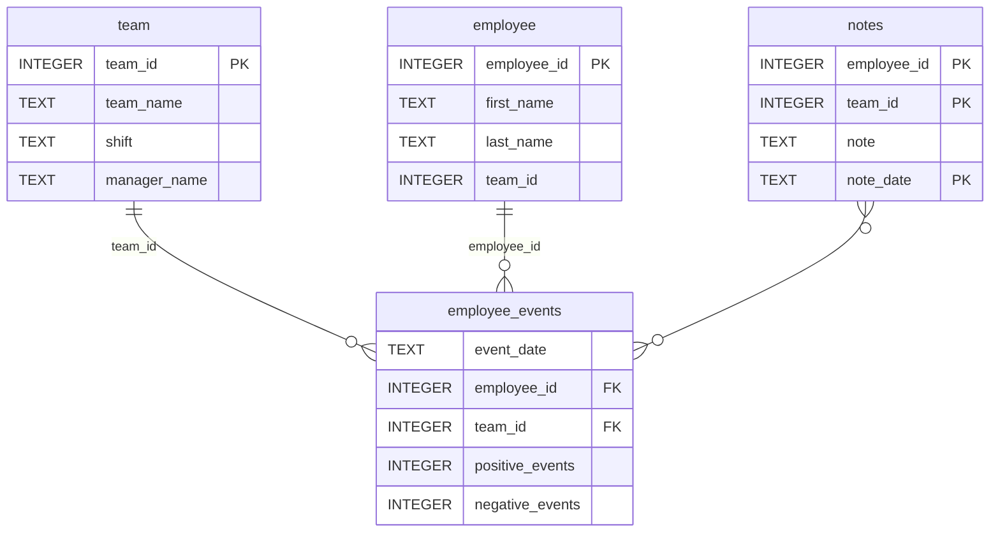

# Software Engineering for Data Scientists

This repository contains the project associated with "Deploying a Scalable Machine Learning Pipeline
in Production" Udacity course. It's a fork of Udacity's [Starter Kit](https://github.com/udacity/dsnd-dashboard-project).

This GitHub.com project is located at [cariad-robert-abel/udacity-dsnd-dashboard-project](https://github.com/cariad-robert-abel/udacity-dsnd-dashboard-project).

## Directory Layouts and Notes

Please find the directory layouts and an Entity Relationship Diagram for the
employee events database below.

### Repository Structure
```
├── assets
│   ├── model.pkl                        Pre-Trained Risk Assessment Model
│   └── report.css                       Cascaded Style Sheet for Report
├── python-package                       employee_events package
│   ├── employee_events                  
│   │   ├── __init__.py                  
│   │   ├── employee.py                  
│   │   ├── employee_events.db           
│   │   ├── query_base.py                
│   │   ├── sql_execution.py             
│   │   └── team.py                      
│   ├── pyproject.toml                   library project metadata
│   ├── setup.py                         setuptools script
│   ├── README.md                        library README
├── report                               Report Dashboard Source Code
│   ├── base_components                  
│   │   ├── __init__.py                  
│   │   ├── base_component.py            
│   │   ├── data_table.py                
│   │   ├── dropdown.py                  
│   │   ├── matplotlib_viz.py            
│   │   └── radio.py                     
│   ├── combined_components              
│   │   ├── __init__.py                  
│   │   ├── combined_component.py        
│   │   └── form_group.py                
│   ├── dashboard.py                     
│   └── utils.py                         
├── tests                                pytest test suite
│   └── test_employee_events.py          
├── pyproject.toml                       repository project metadata
├── README.md                            repository README (this file!)
```

### employee_events.db



## Installation

Install using `pip install [-e] .` from the top-level repository directory.
The `employee_event` library dependency located in the `python-package` sub-directory will be picked
up and installed automatically.

## License

Original files Copyright 2012–2020 Udacity, Inc.
My additions to documentation and code are [MIT](https://spdx.org/licenses/MIT).
See [LICENSE-Udacity](LICENSE-Udacity) resp. [LICENSE](LICENSE).
