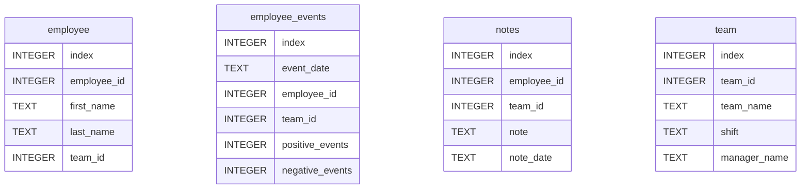

# SQL Query API

This directory contains the `employee_events` package, which provides
an API to query the employee events database.

## Entity Relaitonship Diagram

## License

Original files Copyright 2012–2020 Udacity, Inc.
My additions to documentation and code are [MIT](https://spdx.org/licenses/MIT).
See [LICENSE-Udacity](../LICENSE-Udacity) resp. [LICENSE](../LICENSE).
